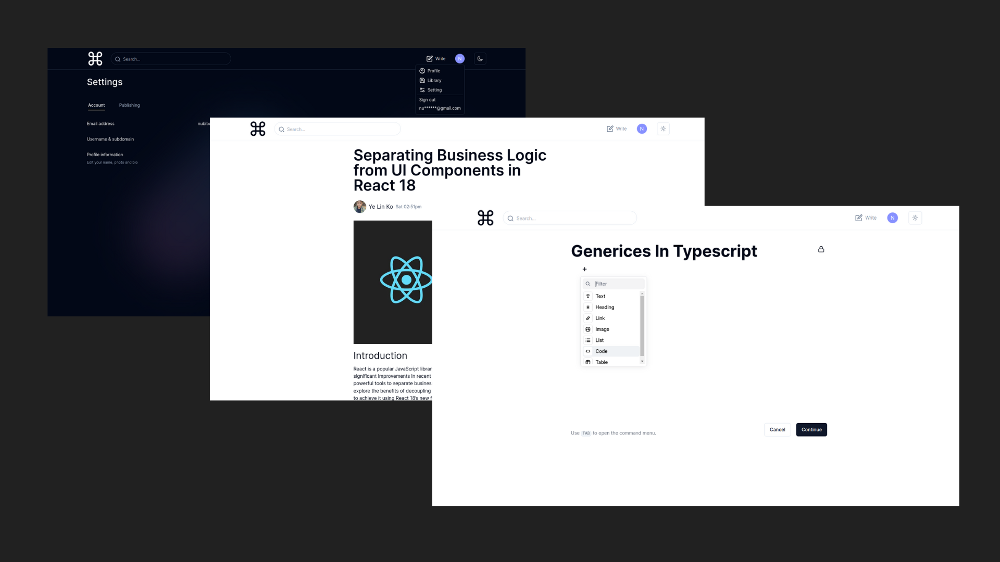

<div align="center">
  <svg 
    xmlns="http://www.w3.org/2000/svg"
            viewBox="0 0 24 24"
            fill="none"
            width=50
            stroke="currentColor"
            strokeWidth="2"
            strokeLinecap="round"
            strokeLinejoin="round"
          >
    <path d="M15 6v12a3 3 0 1 0 3-3H6a3 3 0 1 0 3 3V6a3 3 0 1 0-3 3h12a3 3 0 1 0-3-3" />
 </svg> 
</div>
<h1 align="center">
   BlogPedia
</h1>
<p align="center">
  <a target="_blank">  BlogPedia </a> built with <a href="https://reactjs.org/" target="_blank"> React </a> and <a  target="_blank"> Typescript </a> 
</p>
<br />

<!-- <a href="https://youtube-by-yelinko.netlify.app/" target="_blank"> Live Preview </a> -->

<br />
<br />
 <a href="https://youtube-by-yelinko.netlify.app/" target="_blank">
    
  </a>
  
  <br />
<br />
  <br />
<br />

> The app is built by cloning medium as exactly as possible with all the features & design mocks up.

 <br />
<br />

## Built with

```bash

 React Typescript Node.Js ExpressJs

 MySQL  Redux-toolkit

 TailwindCSS React-Query

```

  <br />

## Used

```bash
 Vite(Typescript)  React-Router-Dom  Prisma
```

<br />

### Fonts

```bash
Inter
```

 <div align="center">
  
  <h6> Built By <a href="https://github.com/yelinko20">Ye Lin Ko</a></h1>
</div>
